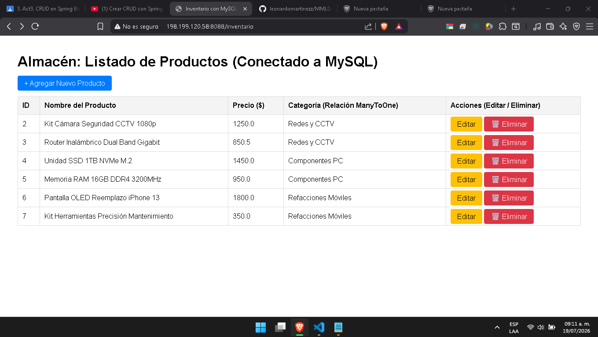
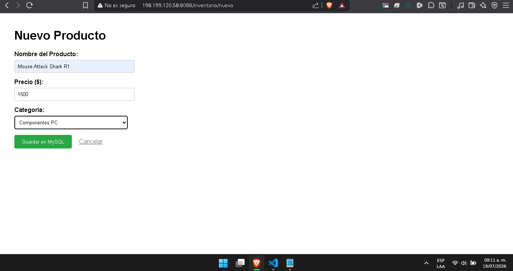
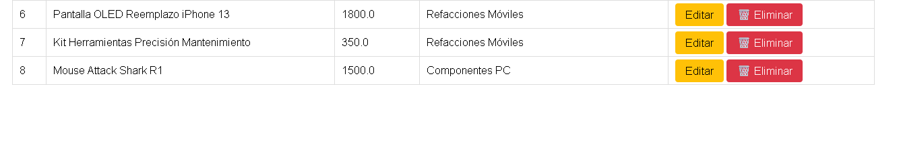
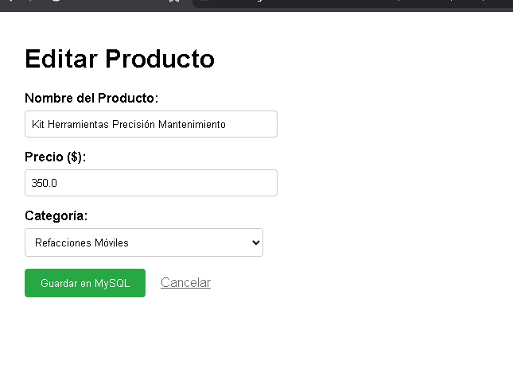
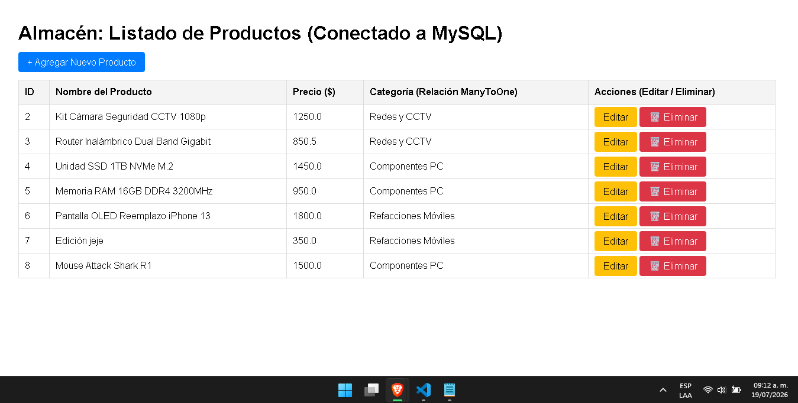
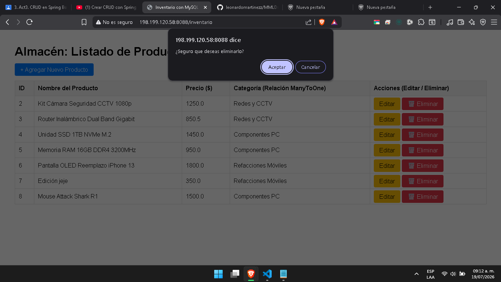
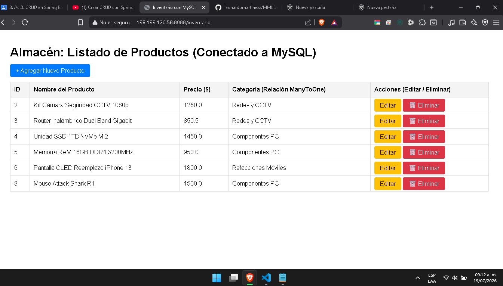

# Sistema de Gestión de Inventario (CRUD Spring Boot & JPA en VPS)

MARTÍNEZ MIGUEL LEONARDO DANIEL
## Acceso a la Aplicación en Producción

La aplicación se encuentra desplegada y funcionando en un servidor VPS con las reglas de firewall configuradas para permitir el tráfico web:

* **URL del sistema:** [http://198.199.120.58:8088/inventario](http://198.199.120.58:8088/inventario)

## Evidencias de Despliegue y Funcionalidad (CRUD)

### 1. Lectura (Read) y Relación @ManyToOne Reflejada
> **Evidencia de Lectura y Relación @ManyToOne:** En la columna *Categoría* se aprecia que al consultar los Productos se imprime el nombre en texto de la Categoría asociada (ej. *Redes y CCTV*, *Componentes PC*) y no su ID numérico, confirmando el mapeo correcto de la llave foránea en JPA desde la base de datos MySQL en el VPS.

### 2. Creación de Registros (Create)
> **Evidencia de Creación:** Formulario de registro para un nuevo producto, vinculándolo correctamente a una categoría existente en el servidor.

Aqui podemos ver que si se creó 

### 3. Actualización de Datos (Update)
> **Evidencia de Actualización:** Modificación exitosa de los parámetros de un producto registrado en la base de datos remota.

Aquí vemos que SÍ se actualizó

### 4. Eliminación de Registros (Delete)
> **Evidencia de Eliminación:** Remoción completa de un registro del inventario, actualizando la vista y la base de datos al instante.

Aquí vemos que sí se efectuó el borrado

